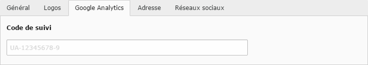

# Google Analytics

Pour associer un compte Google Analytics :

* Sélectionner le mode **Liste** dans la [Liste des modules](../premiers-pas/se-reperer-dans-le-backend.md).
* Cliquer sur la page **Configuration** dans l'[Arborescence](../premiers-pas/se-reperer-dans-le-backend.md);
* Cliquer sur l’icône **Éditer l'enregistrement** sur la ligne comprenant le **titre actuel du site** dans la [Vue détaillée](../premiers-pas/se-reperer-dans-le-backend.md) ;

* Sélectionner l'onglet Google Analytics.

Ajouter le **Code de suivi** dans le champ prévu à cet effet et **enregistrer** les modifications.

> Pour récupérer votre code de suivi, rendez-vous sur le site [https://www.google.com/analytics/](https://www.google.com/analytics/), se connecter et dans l'administration, créer une nouvelle propriété \(procédure via le guide officiel de Google [disponible ici](https://support.google.com/analytics/answer/1042508?hl=fr&ref_topic=1009620)\).
>
> Le code de suivi commence toujours par les deux lettres **UA** suivi de **9 chiffres.**

