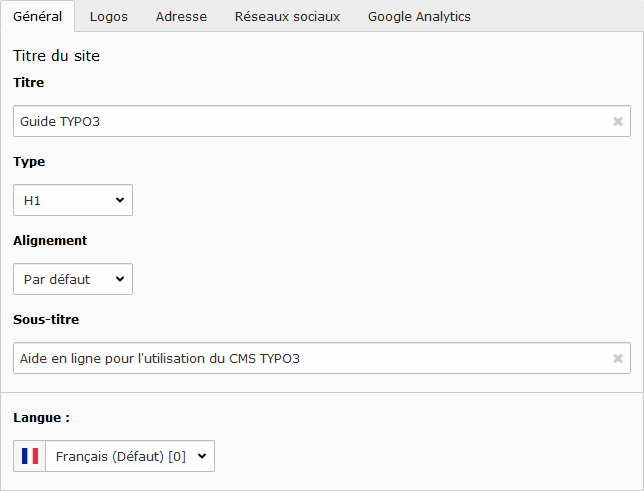

# Informations générales

Pour ajouter ou modifier les informations du site :

* Sélectionner le mode **Liste** dans la [Liste des modules](../premiers-pas/se-reperer-dans-le-backend.md).
* Cliquer sur la page **Configuration** dans l'[Arborescence](../premiers-pas/se-reperer-dans-le-backend.md);
* Cliquer sur l’icône **Éditer l'enregistrement** sur la ligne comprenant le **titre actuel du site** dans la [Vue détaillée](../premiers-pas/se-reperer-dans-le-backend.md).

En haut de la vue détaillée, différentes actions sont proposées :

 annuler les modifications ;

 enregistrer les modifications ;

> **Note :** 
>
>  permet de sélectionner l'action qui suit l'enregistrement, comme fermer le mode édition.

> **Note :**
>
> Pour toutes modifications dans la partie **Configuration**, il est nécessaire de **Vider le cache** du site pour quelles soient prisent en compte instantanément.

## Général

**Titre** : changer le titre du site ;

**Type** : définir le type du titre, agit sur la taille affichée ;

**Alignement** : définir l'alignement du titre, à gauche par défaut ;

**Sous-titre** : ajouter un sous-titre en dessous du titre, affiché à la ligne ;

**Langue** : définir la langue pour laquelle le titre et le sous-titre doit être affiché.

## Logos

**Logo principal** : ajouter le logo du site, affiché en haut à gauche du bandeau ;

**Logo partenaire** : ajouter un logo partenaire \(possibilité d'ajouter également un lien\), affiché en haut à droite du site \(en fonction de la charte graphique sélectionnée\) ;

**Logos partenaires supplémentaires** : ajouter jusqu'à 5 logos partenaires \(avec liens\), affiché en fonction de la charte graphique sélectionnée ;

## Adresse

> Cette section est uniquement utilisé par la charte graphique Eole.

Liste de champs d'adresse \(**Titre**, **Adresse**, **Code postal**, **Ville** et **Pays**\) et de contact \(**Téléphone**, **Fax** et **Adresse mél**\) à afficher en pied de page du site.

## Réseaux sociaux

Voir page [Réseaux sociaux](reseaux-sociaux.md).

## Google Analytics

Voir page [Google Analytics](google-analytics.md).

