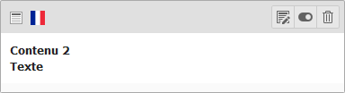

# Éditer élément de contenu

Pour éditer, cacher ou supprimer un contenu existant dans une page :

* Sélectionner le mode **Page** dans la [Liste des modules](../premiers-pas/se-reperer-dans-le-backend.md) ;
* Cliquer sur la page dans laquelle doit être inséré le contenu dans l'[Arborescence](../premiers-pas/se-reperer-dans-le-backend.md);

La liste des contenus présents dans la page est organisée par zone d'affichage \(en fonction du modèle du site\) et affiché dans la [Vue détaillée](../premiers-pas/se-reperer-dans-le-backend.md).

Repérer le contenu à modifier et cliquer sur le bouton  **Éditer le contenu**.

> **Note :**
>
>  Cacher/afficher le contenu. Il est possible ainsi de préparer un contenu sans qu'il soit visible par les internautes.
>
>  Supprimer le contenu.

