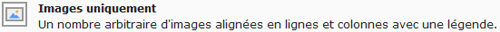
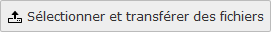
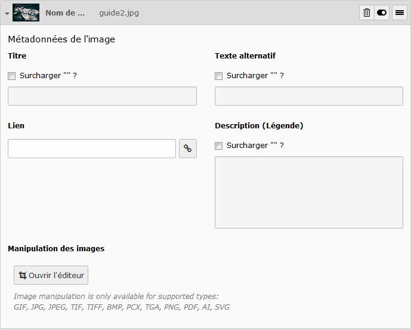
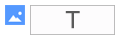
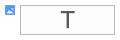

# Image

A partir de la liste vue dans [Créer un élément de contenu](../creer-un-element-de-contenu.md), sélectionner :

Il est également possible de combiner un élément **Images** avec un élément **Texte**, sélectionner :

> **Note :** Comme dans la plupart des types de contenu, il est possible de renseigner un **Titre**. Pour plus d'informations, se référer à la fiche de l'élément [Titre](titre.md).
>
> Pour un contenu de type **Texte & images**, se référer à la fiche dédiée à l'élément [Texte](texte.md).

Un onglet **Images** est disponible, il permet d'ajouter et configurer des images.

## Position

> Uniquement pour le contenu **Texte & Image**

Ce champ permet de définir le placement de l'image par rapport au texte associé.

## **Colonnes**

Ce champ définit le nombre d'images affichées par ligne.

| 2 images sur 1 colonne | 3 images sur 2 colonnes | 5 images sur 3 colonnes |
| :---: | :---: | :---: |
|  |  |  |

## **Images**

Cette zone permet d'ajouter une ou plusieurs images.

Pour ajouter une ou plusieurs images, cliquer sur le bouton **Ajouter une image**.

Une nouvelle fenêtre s'ouvre, articulée en deux colonnes, elle permet d'effectuer une sélection d'une ou plusieurs images.

La colonne de gauche présente l'arborescence du dossier des ressources \(voir [Gestion des fichiers](https://www.gitbook.com/book/agrosup-dijon-eduter/guide-utilisation-typo3/edit#)\), sélectionner le répertoire contenant la ou les images à insérer.

La colonne de droite s'actualise avec la liste des fichiers images présents dans le répertoire choisi.

 Image non sélectionnée

 Image sélectionnée

 Importer la sélection

Sélectionner les images désirées et cliquer sur ****l'icône **Importer la sélection**.

Si l'image n'existe pas dans le répertoire des ressources, il faut alors la télécharger depuis le poste utilisateur.

En bas de la fenêtre se trouve la zone **Envoyer des fichiers**. Cliquer sur **Parcourir** pour sélectionner les fichiers images depuis le poste utilisateur. Cliquer sur **Envoyer des fichiers** pour télécharger les images dans le répertoire sélectionné dans la colonne arborescence du dossier des ressources.

> **Note :**
>
> 
>
> Il est possible d'ajouter directement une ou plusieurs images depuis le poste utilisateur, cliquer sur le bouton **Sélectionner et transférer des fichiers**.
>
> Une nouvelle fenêtre \(en fonction du système d'exploitation de l'utilisateur\) pour la sélection du fichier s'affiche. L'image est ainsi téléchargée sur le serveur, dans le dossier des ressources \(voir [Gestion des fichiers](https://www.gitbook.com/book/agrosup-dijon-eduter/guide-utilisation-typo3/edit#)\).

Une fois les images importées, elles s'affichent par ordre d'apparition et peuvent être modifiées :

 supprimer l'image du contenu \(ne supprime pas l'image du dossier de ressource\) ;

 cacher/afficher l'image ;

 sélectionner l'image pour changer l'ordre d'apparition par glisser/déposer :

Cliquer sur **Nom de fichier** pour éditer les informations relatives à l'image ou l'éditer :

**Titre :** ajouter un titre pour l'image \(par défaut, le nom du fichier\) ;

**Texte alternative :** ajouter un texte qui s'affiche si l'image n'est plus disponible ;

**Lien :** ajouter un lien accessible lors du clic sur l'image ;

**Description :** ajouter un texte associé à l'image ;

**Manipulation des images :** recadrer l'image avec un éditeur simple.

## Agrandissement au clic

Une fois activée, cette option permet d'agrandir l'image à la taille de l'écran de l'internaute lors du clic sur cette dernière.

Pour le contenu **Texte & Image**, un onglet **Apparences** est disponible, il permet de modifier la taille de la colonne image.

## Mise en page

> Uniquement pour le contenu **Texte & Image**

Ce champ définit la taille de colonne des images :

| 1/3 | 1/4 | 1/6 | Par défaut \(1/2\) |
| :---: | :---: | :---: | :---: |
|  |  |  |  |

