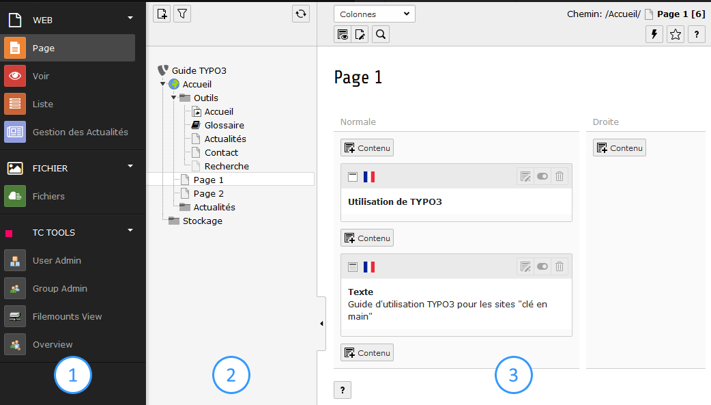

# Se repérer dans le "Backend"

Après identification, TYPO3 propose d'accéder directement à différents espaces.

## Barre d'outils

Cette barre, affichée en entête de manière permanente, permet \(de gauche à droite\) :

* accéder aux éléments mis en favoris ;
* vider les caches du site ;
* éditer son compte utilisateur ;
* se déconnecter et fermer sa session ;
* effectuer une recherche.

## Zones de gestion

### Zone 1 \| Liste des modules

Sous forme de menu, cet élément représente le point d'entrée pour toutes les actions d'administration :

* Page : permet de gérer les pages du site ainsi que leurs contenus ;
* Voir : permet de prévisualiser une page depuis l'interface d'administration ;
* Liste : permet de gérer les enregistrements liés à une page ;
* Gestion des Actualités : permet de gérer les actualités du site ;
* Fichiers : permet gérer les fichiers stockés sur le site ;
* TC TOOLS : différents outils réservés à l'administrateur pour gérer les utilisateurs "Backend".

### Zone 2 \| Arborescence

Cet espace permet de créer ou sélectionner, de façon hiérarchique, les dossiers et pages du site.

### Zone 3 \| Vue détaillée

A partir d'une page ou dossier sélectionné, cette zone affiche les éléments de contenu ou autres éléments liés en fonction du module sélectionné dans la zone 1.

